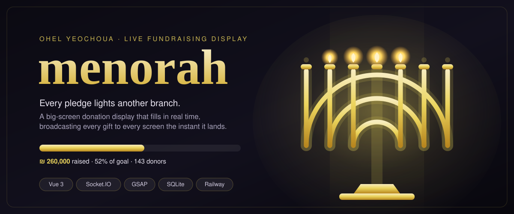
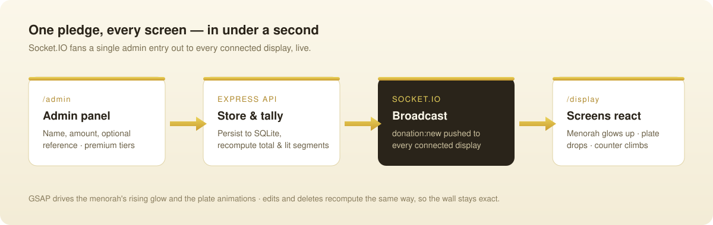

<p align="center">
  
</p>

<p align="center">
  <a href="#quick-start"></a>
  
  
  
  
</p>

---

## What you get on the wall

**menorah** is the live donation display behind the *Ohel Yeochoua* fundraising campaign. An operator sits at a laptop and types in each gift as it is pledged; every screen in the room reacts at once — a golden menorah lights up branch by branch, a plate engraved with the donor's name slides in, the total counter climbs, and a celebration GIF and sound mark the moment.

It is built for the room, not the browser tab: several dedicated display routes drive different screens (the full board, a lighter variant, a hidden/warm-up view), all fed from one shared real-time state.

| The illumination | The recognition | The momentum |
| :-- | :-- | :-- |
| A segmented menorah SVG fills from the base upward as the total crosses configurable thresholds. | Every donor becomes an animated plate, tiered gold / diamond / bronze by gift size. | A live counter and progress bar animate toward the campaign goal on each pledge. |

---

## What it is

A two-part TypeScript app:

- **Backend** — Express + Socket.IO, with donations persisted in a SQLite database (`sql.js`). It owns the truth: it stores each gift, recomputes the running total, the completion percentage, and which menorah segments should be lit, then broadcasts that snapshot to every client.
- **Frontend** — a Vue 3 (Composition API) single-page app built with Vite. GSAP drives the menorah's rising glow, the donor-plate entrances, and the counter animations. Socket.IO keeps every open screen in lockstep.

In production the frontend is compiled into the backend's `public/` folder, so a single Node process serves the admin panel, the display screens, the REST API, and the websocket together.

---

## Why it works the way it does

The hard part of a live fundraising wall is not drawing a menorah — it is keeping four screens, an operator, and a database telling **exactly the same story** while pledges arrive in bursts.

menorah solves that by making the server the single source of truth. The admin never computes anything visual. When a donation is created, edited, or deleted, the backend recalculates the whole picture and emits one authoritative event:

```jsonc
// donation:new  — one broadcast, consumed by every screen
{
  "donation": { "id": 88, "firstName": "…", "lastName": "…", "amount": 18000 },
  "stats": {
    "totalAmount": 26000000,     // in centimes
    "donationCount": 143,
    "percentComplete": 52,
    "litSegments": ["base", "stem", "branch-l1", "branch-r1"]
  }
}
```

Because the *stats* travel with every event, a screen that just connected — or one that briefly dropped Wi-Fi — renders the correct menorah state without any client-side bookkeeping. Edits and deletes flow through the same recompute, so the wall can never drift out of sync with the ledger.

<p align="center">
  
</p>

---

## The screens

| Route | Purpose |
| :-- | :-- |
| `/admin` | Operator console — enter and edit donations, set thresholds and colors, manage celebration GIFs. |
| `/display` | The main board — menorah, donor plates, stats, and celebration effects together. |
| `/display-light` | A lighter display variant for a second screen. |
| `/display-hidden` | A warm-up / hidden view for staging. |

Everything on the display side is configurable from the admin panel without touching code: illumination thresholds, plate tier colors, background, and the predefined donation amounts.

---

## Quick start

Requires Node.js 18+.

```bash
git clone https://github.com/Mickael101/menorah.git
cd menorah

# 1) Backend — API + Socket.IO + SQLite
cd backend
npm install
npm run dev          # http://localhost:3000

# 2) Frontend — Vite dev server (new terminal)
cd ../frontend
npm install
npm run dev
```

Open the operator console at `/admin`, put `/display` on the big screen, enter a donation, and watch the menorah light up.

### Production build

`railway.json` / `nixpacks.toml` describe the deploy exactly: build the frontend, copy `dist/` into `backend/public`, build the backend, then run a single Node server.

```bash
cd frontend && npm install && npm run build
mkdir -p ../backend/public && cp -R dist/* ../backend/public
cd ../backend && npm install && npm run build && npm start
```

---

## Tech stack

| Layer | Choice |
| :-- | :-- |
| Frontend | Vue 3 · Vue Router · Vite · TypeScript |
| Animation | GSAP |
| Realtime | Socket.IO (client + server) |
| Backend | Express · TypeScript |
| Storage | SQLite via `sql.js` |
| Uploads | Multer (celebration GIFs) |
| Deploy | Railway (Nixpacks) |

---

## Project layout

```text
backend/
  src/
    models/      donation, config, stats, types
    services/    donation.service, config.service, socket.service
    routes/      donations, config, stats, gifs
    db/init.ts   SQLite bootstrap
    index.ts     Express + Socket.IO entry point
frontend/
  src/
    pages/           AdminPanel, DisplayPage, DisplayPage8, DisplayHiddenPage
    components/
      admin/         DonationForm, ConfigPanel, GifManager, DonationList…
      display/       MenorahDisplay, DonorPlate(s), ProgressBar, TotalCounter…
    composables/     useSocket, useDonations, useSoundEffects
    public/assets/   menorah SVGs
specs/             feature spec, data model, API + socket contracts
```

---

## License

No license file is currently included in this repository, so all rights are reserved by default. If you intend to reuse or deploy it, contact the repository owner or add an explicit license.
